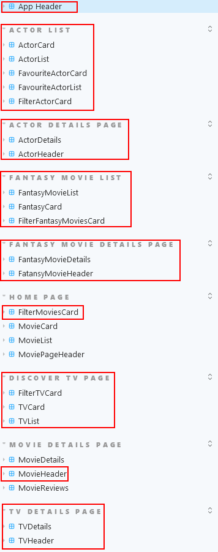
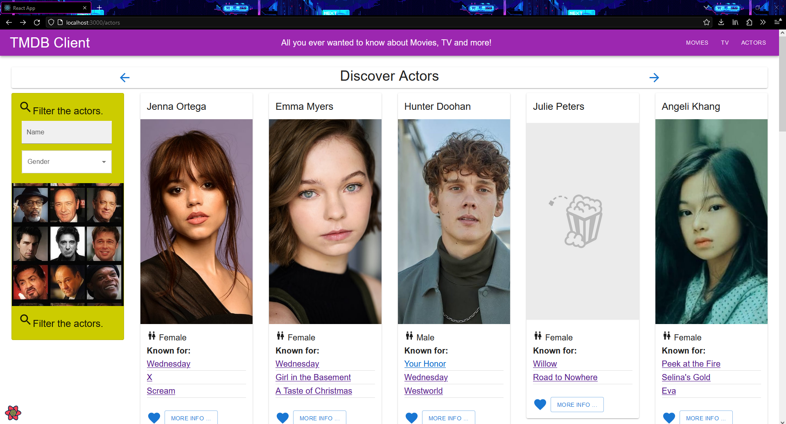

# Web App Dev 2 - Assignment 1 - ReactJS app.

Name: Dylan Fennelly (20093427)

## Overview.

### New Pages.

+ (Modified) All pages - Site header layout changed to 3 dropdown menus for each category: Movies, TV, Actors.
+ (Modified) Home page - Addition of new filtering options on filter card, new image used for filter card.
+ (Modified) Movie Details page - Added favourite icon/remove from favourites to Movie Header
+ (Modified) Upcoming movies page - Addition of new filtering options on filter card, new image used for filter card.
+ Top Rated Movies - Displays list of top rated movies.
+ Discover TV - Displays list of TV series from TMDB discover TV endpoint.
+ TV Details page - Shows information about selected TV series.
+ TV Review page - Displays review for TV series from reviews list on TV Details page.
+ TV Favourites page - Shows favourited TV series.
+ Discover Actors - Displays list of popular actors from TMDB popular actors endpoint.
+ Actors Detials page - Displays information about selected actor.
+ Favourite Actors page - Showss favourited Actors.
+ Fantasy Movies page - Displays list of created fantasy movies.
+ Fantasy Movies Details page - Displays details of select fantasy movie.
+ Add Fantasy Movie page - Fourm to enter details for and create fantasy movie .

### New Features.

+ Extended filtering:
    + Filter Movies by title, genres, rating, and language.
    + Filter TV Series by name, genres, rating, and language.
    + Filter Actors by name and gender.
    + Filter Fantasy Movies by title and genres.
+ Add to Favourites on Movie, TV Series and Actor detail pages.
+ Top Rated movies.
+ TV Series
    + Discover TV series.
    + Favourite TV series.
+ Actors
    + Popular Actors.
    + "Known for" hyperlinks on Actor cards.
    + Favourite Actors.
+ Create Fantasy Movie
    + Name, Overview, Genres, Release Date, Production Company, Actors, Movie Poster.
+ Full caching support

## Setup requirements.

+ .env file must include `FAST_REFRESH=false`

## TMDB endpoints.

+ /movie/top_rated - A list of all time top rated movies.
+ /discover/tv - A list of TV shows, chosen by a blend of rating, popularity, and recency.
+ /tv/{id} - The details of a TV show
+ /genre/tv/list - A list of TV-relevant genres.
+ /tv/{id}/images - The images for a TV show.
+ /tv/{id}/reviews - The reviews for a TV show.
+ /person/popular - A list of popular actors.
+ /person/{id} - The details of an Actor.
+ /person/{id}/images - The images for an actor.

## App Design.

### Component catalogue.

### UI Design.

>Updated filter card allows for filtering of movies by rating and language; features new image on filter card

>Site header breaks down site into three dropdown categories: Movies, TV, and Actors

>Add/remove movie from favourites function added to movie details page

>Shows the top rated movies of all time.

>Displays a list of TV series based on a blend of rating, popularity, and recency. Filter card allows for filtering by name, genre, rating and language. More details about each TV series can be viewed, and each series can be added to favourites.

>Displays a variety of TV series details, including an overview, number of seasons, first air date, and countries. Movies can be added to and removed from favourites, and reviews can be viewed.

>Shows the contents of a TV series' review.

>Displays TV favourites. From here, favourites can be removed.

>Displays a list of popular actors. Filter card allows for filtering by name and gender. More details about each actor can be viewed, and each actor can be added to favourites. A short list of movies/tv series each actor is known for is displayed on their card, and can be clicked on to view that movie/tv series' details.

>Displays actor details, including name, biography, gender, birth date, death date (if applicable), and birth location. Actors can be added to and removed from favourites.

>Displays favourite actors. From here, favourites can be removed.

>The form for adding a fantasy movie. Multiple details can be added, including name, overview, genres, release date, cast members (optional), production company, and a poster image (optional). Genres are selected from the dropdown list and added using the button, and can be removed by clicking the fab icon of the desired genre. Release date must adhere to the YYYY-MM-DD format. Cast members are populated from the user's favourite actors and are added/removed the same way as the genres. An image can be selected locally from the computer and uploaded to the web application to use as a poster image. The reset button resets the form fields, while the submit button adds the fantasy movie (if all mandatory fields have been filled and adhere to required formats/lengths).

>Displays all created fantasy movies. Filter card allows for filtering by title and genre. More details about each movie can be displayed, and a new fantasy movie can be added by selecting the fab in the bottom right.

>Shows info about a fantasy movie, including overview, genres, release dat, cast members and production company.

### Routing.

+ /movies/top - displays top rated movies.                          (TopMoviesPage)
+ /tv - shows a list of discover tv series.                         (DiscoverTVPage)
+ /tv/:id - shows details of a specific movie.                      (TVDetailsPage)
+ /tv/reviews/:id - shows specific tv review details.               (TVReviewPage)
+ /tv/favourites  - displays favourited TV series.                  (FavouriteTVPage)
+ /actors - shows a list of popular actors.                         (PopularActorsPage)
+ /actors/:id - displays details for specified actor.               (ActorDetailsPage)
+ /actors/favourites - shows favourited Actors.                     (FavouriteActorsPage)
+ /movies/fantasy - displays all created fantasy movies.            (FantasyMoviesPage)
+ /movies/fantasy/new - form to add new fantasy movie.              (AddFantasyMoviePage)
+ /movies/fantasy/:id - shows details of specific fantasy movie.    (FantasyMovieDetailsPage)

## Independent learning (If relevant).

+ https://smartdevpreneur.com/how-to-make-mui-typography-text-italic-bold-or-with-ellipses/
    + Consulted to style MUI Typography component (/components/actorCard/index.js:90)

+ https://stackoverflow.com/questions/16215771/how-to-open-select-file-dialog-via-js
    + Used to implement image upload for fantasy movie (/components/fantasyMovieForm/index.js:57)

+ https://beta.reactjs.org/learn/updating-arrays-in-state
    + Worked alongside to created genre fabs that actively and populate (/components/fantasyMovieForm/index.js:75)

